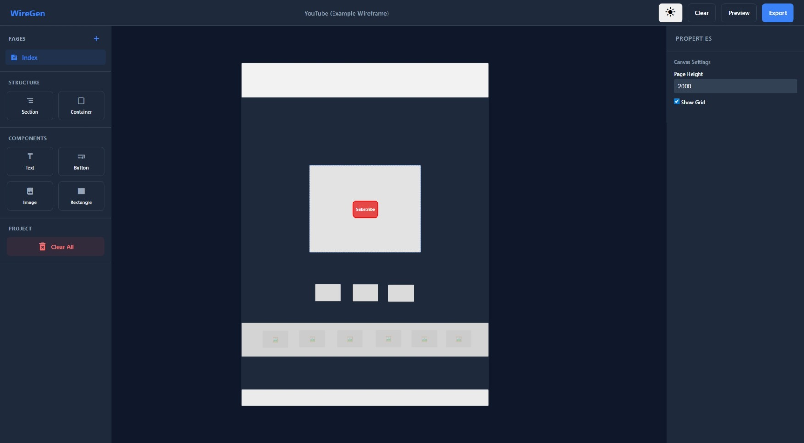

# WireGen (WP)

WireGen is a simple wireframe editor designed for quickly sketching out web layout ideas. You can place elements on a canvas, customize them, and export the result as a ready-to-use HTML/CSS package.



## Development

To work on the project locally, first install the dependencies:

```bash
npm install
```

Then, start the development server:

```bash
npm run start
```

The application will be available at `http://localhost:4200`.

## Build and Deployment

Since this application uses Angular SSR (Server-Side Rendering), there are a few things to keep in mind for building and deployment.

### Creating a Build
To create a production-ready build, use the standard build command:

```bash
npm run build
```

This command generates both the client files and the server bundle in the `dist` folder.

### Running in Production
After the build is complete, you can start the SSR server:

```bash
npm run serve:ssr:WireGen
```

Alternatively, you can run the generated server script directly with Node:

```bash
node dist/WireGen/server/server.mjs
```

This is the standard way to run the application on a server (e.g., behind a reverse proxy like Nginx).
